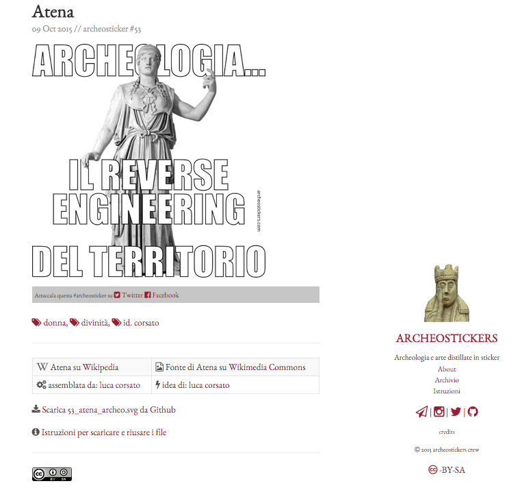

## [archeostickers.com](http://archeostickers.com)

## Cosa sono le archeostickers
Archeostickers sono un pacchetto di stickers per [Telegram](http://telegram.me). Segui le [istruzioni](http://archeostickers.com/pages/istruzioni/) per installarle

## Chi ha creato archeostickers
Archeostickers sono un prodotto di [opensensorsdata]({{ site.url }}{{ site.baseurl }}about) in collaborazione con (le nostre amichette) [Professione Archeologo](http://www.professionearcheologo.it/) and [ArcheoPop](http://www.civettadiatena.it/).

## Perché abbiamo creato archeosticker
Principalmente vogliamo:

* dimostrare che si può vedere l'arte e l'archeologia sotto l'aspetto del gioco e della traduzione iconica
* riusare l'enorme patrimonio di immagini e informazioni disponibili su [Wikimedia Commons](https://commons.wikimedia.org/wiki/Main_Page)
* far riusare tutto quello che abbiamo creato qui in modo aperto

## Inoltre abbiamo voluto usare [Jekyll](https://jekyllrb.com/) e [Github](https://github.com/archeostickers) <small>- come anche il [sito di osd](https://github.com/opensensorsdata/opensensorsdata.github.io) -</small> perché:

* sono gli strumenti sempre più usati
* è un'ottima scusa per avvicinare gli umanisti al fantastico mondo del codice
* perché sono gratuiti e con un po' di dimestichezza possono rendere autonomi per svolgere sempre più attività
* il codice (anzi... i codici) non sono altro che lingue: chi si occupa di archeologia, di arte ha imparato lingue molto più complesse... quindi non avete scuse!

## Le Archeostickers vogliono bene a Wikipedia
La fatica dell'archiviare, catalogare e compilare conoscenza condivisa non deve andare mai sprecata.

Tutto ciò che è stato compilato, scritto, corretto e caricato su Wikipedia e Wikimedia Commons è un patrimonio che è lì per essere riusato. Non farlo è:

- un'offesa verso tutti quelli che hanno faticato
- un rischio per il mancato controllo di vandalismi o aggiornamenti

Per questo ogni immagine usata per creare un'archeosticker è presa da Wikimedia Commons e allo stesso modo **l'archeosticker è riutilizzabile a sua volta anche a scopi commerciali**.

### Noi auspichiamo il riuso perché è la prova della bontà dello sforzo prodotto.

Riconoscere il riuso - e attribuirne la fonte - significa porre le fondamenta del proprio lavoro e incardinarlo in una filiera dove il valore non è dato dall'*esclusività* ma dalla sua **disponibilità**.

## TUTTE le archeostickers sono riutilizzabili anche a scopi commerciali
perché le rilasciamo con licenza [Creative Commons Attibuzione Condividi allo stesso modo]((http://creativecommons.org/licenses/by-sa/4.0/) e

### [questo stesso sito può essere scaricato e - ovviamente - riutilizzato](https://github.com/archeostickers/archeostickers.github.io)
con due uniche richieste:

- dire che le abbiamo fatte noi (archeostickers)
- condividere allo stesso modo

<small>*(esempio: ti puoi fare e vendere un libro con le nostre archeostickers ma non puoi averne né l'esclusiva e nemmeno metterci la simpatica scritta "tutti i diritti riservati")*</small>

# le archeostickers sono un riuso aperto di tutto ciò che è stato condiviso
