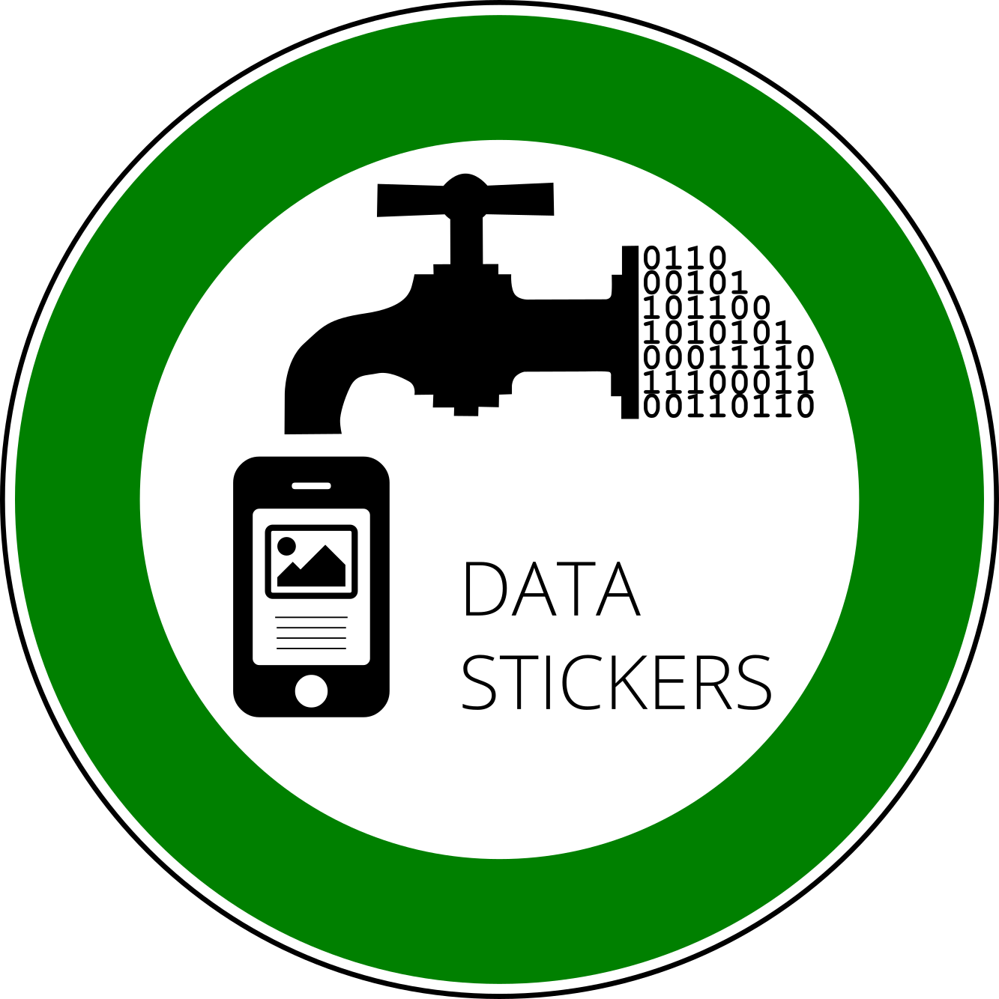

## Che cos’è
Datastickers è un prodotto per trasmettere e conviderei dati estratti da sensori o contenuti in banche dati attraverso la creazione automatica di icone, immagini e frasi dalla cultura comune, per generare un coinvolgimento con le persone. Datastickers converte le informazioni dai dati alle connessione e conversazioni in cui è attivo.
La proposta di valore sfrutta i vantaggi della comunicazione iconica per abbassare il costo cognitivo della fruizione delle informazioni. Il suo obiettivo è migliorare la qualità delle interazioni uomo/macchine producendo contenuti stream familiari e partecipativi per gli utenti.

## Value Proposition
La proposta di valore si concentra sul potenziamento dei modelli di business in due modi:

* permette di integrare le competenze come parte della promozione delle attività di una struttura.
* permette di riduzione dei costi delle attività di disseminazione.

In primo luogo, permette di valorizzare le competenze tecniche dietro la gestione e la creazione di dati che spesso, per strutture fortemente orientate ad attività tecniche o specialistiche come gli enti di ricerca, è di difficile integrazione all’interno dello schema di attività.
In secondo luogo, permette di integrare questa attività a costi ridotti, aumentando l’accessibilità e l‘adozione anche da parte di entità, di cui sopra, che spesso non includono la disseminazione nel loro core business.
In sintesi basso costo di assunzione alto grado di integrabilità ai diversi obiettivi lavorativi (1).
La traduzione iconica, elemento centrale della cybercultura contemporanea –gif e meme, tra gli altri– permette di rendere l’accessibilità alle informazioni meno dipendente dalle competenze personali di chi le fruisce;  aumentando così il panorama di soggetti interessati alle banche dati.

## Specifiche tecniche
Datastickers è costituita da codice, frasi e immagini sono prodotte internamente. Il codice consente di esporre contenuti in maniera automatizzata e creare messaggi alfanumerici precomposti da banche dati statiche (a bassa frequenza di aggiornamento) fino a banche dati in tempo reale (compresi sensori).
Entrambe le tipologie sono agganciabile ad API rese disponibili dai maggiori servizi web. Questo consente di:

* Centrare gli obiettivi di valore, come da (1)
* concentrare le attività sull’ottimizzazione dei dati e la loro condivisione automatica (sfruttabile innanzitutto internamente alle strutture)

## Offerta
Datastickers è composta da:

* il codice di connessione e condivisione ad una banca dati (la produzione dei canali di condivisione - attraverso API, json o fogli di calcolo -  delle banche dati è a carico del fornitore e/o gestore delle banche dati)
* ideazione, progettazione e realizzazione delle matrici interpretative per le immagini descrittive e dei messaggi informativi
* collegamento e sovrapposizione ad eventuali altre banche dati condivise in modalità aperta (come ad esempio Wikipedia e Openstreetmap)
* assistenza per i primi 30 giorni di esercizio

## Come acquistare Datastickers?
Ci potete contattare (contact@opensensorsdata.it) oppure, se lavorate nel settore pubblico, ci potete trovare nel **[MEPA - the Italian Digital Market for Public Sector](https://www.acquistinretepa.it/opencms/opencms/main/programma/strumenti/MePA)**.

## PorcellinoBot

Il primo esempio di Datastickers è **[PorcellinoBot](http://telegram.me/porcellinobot)** per renderizzare i dati climatici a Firenze. PorcellinoBot è fatto (con amore) da osd e [CNR Ibimet](http://www.ibimet.cnr.it/)

<i class="fa fa-exclamation-triangle" aria-hidden="true"></i> *UPDATE* PorcellinoBot
è in manutenzione!

